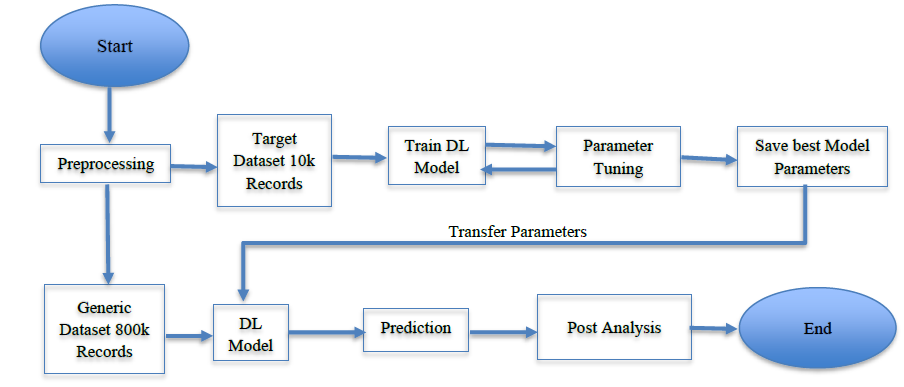
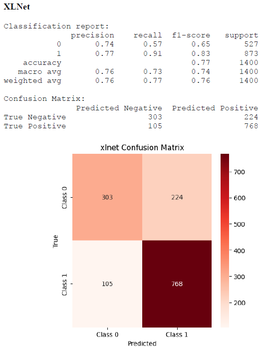
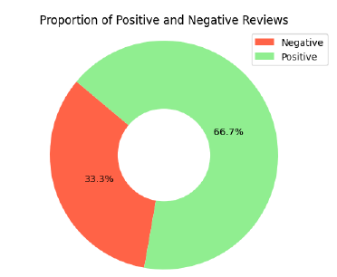
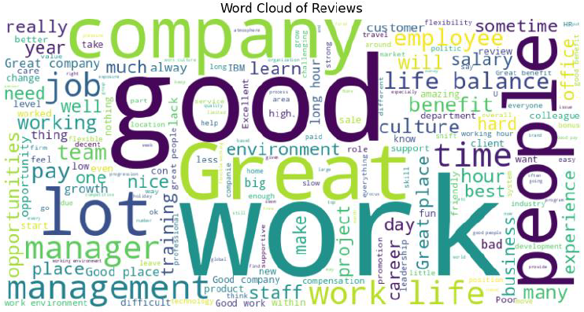
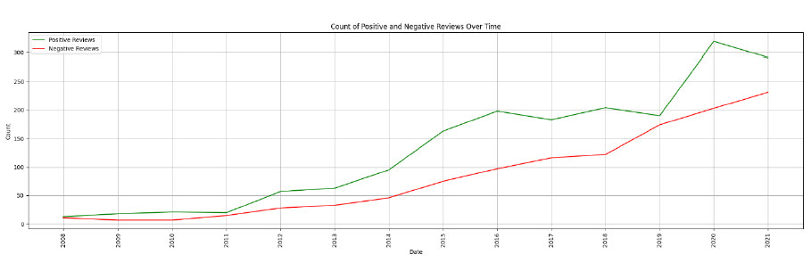
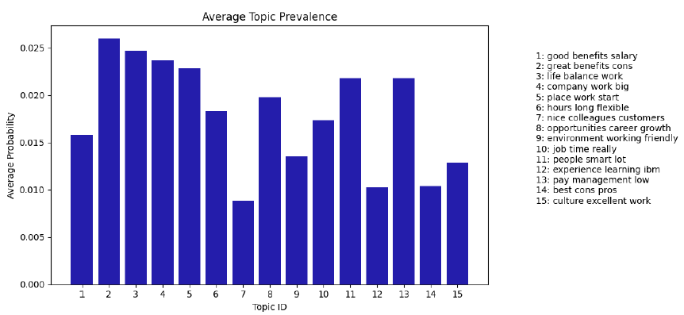
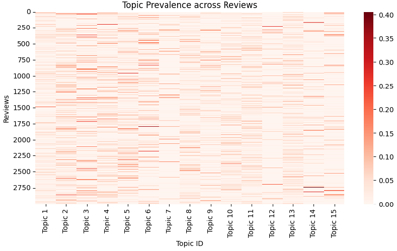
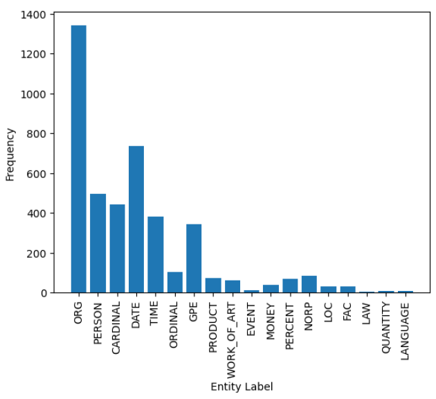

# Transformer-based Sentiment Analysis, Topic Modelling, and Insight Extraction from Company Reviews

This repository contains the full MSc Data Science project focused on analysing Glassdoor UK company reviews using transformer-based models.  
The work combines sentiment classification, topic modelling, and named entity analysis to derive actionable insights about organisational culture and employee perception.

- **FinalReport.pdf** — Complete dissertation  
- **Glassdoor.ipynb** — Main analysis notebook (end-to-end code)  
- **Project Presentation.pptx** — Presentation slides  
- **plots/** — Visualisations referenced in this README  

---

## 📁 Repository Structure

```
.
├── plots/                       # Figures used for the analysis and README
├── Glassdoor.ipynb              # Main Jupyter Notebook
├── FinalReport.pdf              # Full MSc project report
├── Project Presentation.pptx    # Slides used in the project presentation
└── README.md
```

---

# 🔧 Development Workflow

## Overview of the development pipeline used


A complete workflow covering data collection, preprocessing, transformer fine-tuning, prediction tasks, topic modelling, and aspect-based sentiment analysis.

---

# 🤖 Transformer Model Results

## XLNet Confusion Metric


XLNet achieved the strongest scores in the evaluation, especially in recall for positive sentiment.

---

## Model Performance Summary

| Model       | Time (s) | Accuracy | Balanced Acc. | Precision | Recall | F1-Score |
|-------------|----------|----------|----------------|-----------|--------|----------|
| DistilBERT  | 1609.6   | 0.76     | 0.73           | 0.78      | 0.85   | 0.81     |
| BERT        | 3071.2   | 0.76     | 0.72           | 0.77      | 0.88   | 0.82     |
| RoBERTa     | 3062.2   | 0.76     | 0.73           | 0.78      | 0.87   | 0.82     |
| DeBERTa     | 4952.5   | 0.76     | 0.73           | 0.78      | 0.87   | 0.82     |
| **XLNet**   | 6715.4   | **0.77** | **0.73**       | **0.77**  | **0.91** | **0.83** |

---

# 📊 Prediction Insights

## Proportion of Positive and Negative Sentiments


Shows the overall sentiment distribution predicted by the best transformer model.

---

## Word Cloud Visualisation of Company Reviews


Highlights the most frequent terms expressed in employee reviews.

---

## Review Trends Over Time


Tracks shifts in positive and negative sentiment over time.

---

# 🧵 Topic Modelling

## Insights from Topic Modelling


Summarises the most dominant topics discovered using NMF/LDA.

---

## Heatmap of Topic Prevalence


Visualises topic strengths across reviews.

---

# 🧩 Named Entity Recognition & Aspect Sentiment

## Frequencies of Identified Named Entities


Counts of PERSON, ORG, DATE, and other entity types identified in the dataset.

---

## Positive and Negative Sentiments Toward PERSON and ORG Entities


Combines NER and sentiment analysis to identify how employees feel about specific people and organisations.

---

# ▶️ How to Use This Repository

All code for the project is contained in **Glassdoor.ipynb**.  
Open the notebook and run each section sequentially to reproduce:

- Data preprocessing  
- Transformer fine-tuning  
- Sentiment prediction  
- Topic modelling  
- Named entity recognition  
- Visualisations and insights  

No external scripts or requirements files are needed.

---

# 📚 Key References

These references form the foundation of the project.  
Full literature is available in **FinalReport.pdf**.

- **Vaswani et al. (2017)** — *Attention Is All You Need*  
- **Devlin et al. (2019)** — *BERT: Pre-training of Deep Bidirectional Transformers*  
- **Yang et al. (2019)** — *XLNet: Generalized Autoregressive Pretraining for Language Understanding*  
- **Liu et al. (2019)** — *RoBERTa: A Robustly Optimised BERT Pretraining Approach*  
- **He et al. (2021)** — *DeBERTa: Decoding Enhanced BERT with Disentangled Attention*  
- **Pedregosa et al. (2011)** — *Scikit-learn: Machine Learning in Python*  
- **Blei et al. (2003)** — *Latent Dirichlet Allocation*  
- **Bird et al. (2009)** — *Natural Language Processing with Python (NLTK)*  

---

# 📄 Licence

This project is intended for academic and educational use.  
Please cite the dissertation if you use or reference this work.

---
